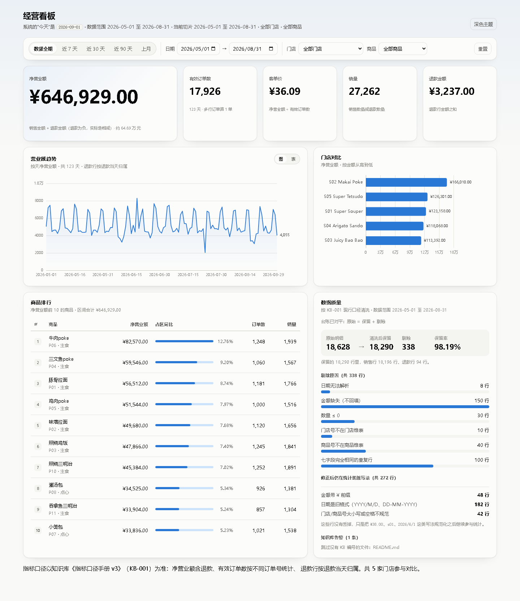

# 经营看板 + 问答服务

给连锁餐饮运营用的内部工具：**一个经营看板**，加**一个能同时查销售数据库和公司知识库的 AI 助手**。

- 后端：Python 3.12 + FastAPI，纯标准库 BM25 检索，无向量模型、无外部服务依赖
- 前端：Vue 3 + Vite + ECharts
- 系统的“今天”固定为 **2026-09-01**（契约规定），前后端所有“最近”“本月”都以它为准
- 指标口径全部按知识库里的**现行**口径手册 KB-001（v3）实现

> 收到作业包时根目录的原始作业说明已移到 [`docs/ASSIGNMENT.md`](docs/ASSIGNMENT.md)，一字未改。
> 本文件是交付说明。



## 交付进度

公开题库（55 题 / 100 分）的分是这样涨上来的，每一轮都记在 [`EVAL_REPORT.md`](EVAL_REPORT.md)：

| 阶段 | 得分 |
|---|---|
| 原始 starter | 17.00 |
| 第一关 · 数据看板 | 44.50 |
| 第二关 · 检索与规划（分词、命中标注、版本、会话…） | 70.00 |
| 第三关 · 回答层与意图闸门 | **90.00** |

| 关卡 | 状态 |
|---|---|
| 第一关 · 数据看板 | **已完成**。两个指标接口按 KB-001 口径实现，与独立复算对拍一致；看板含筛选、趋势、排行、数据质量四块 |
| 第二关 · 修好 RAG 服务 | **已完成**。14 个缺陷的根因、验证与回归测试见 [`DEBUG_LOG.md`](DEBUG_LOG.md)；`retrieval` 14/15 |
| 第三关 · 混合问答 | **已完成**：`/api/chat` 三类问题都答得对（`data` 12/12、`doc` 8/16、`hybrid` 18/18、`refusal` 8/8、`safety` 9/9），看板上的对话框已加（含引用与查询依据），接入预检 14 项全过，[`LLM_SETUP.md`](LLM_SETUP.md) 已交 |
| 第四关 · 可调试性 | **已完成**：调试面板（把 `/api/trace` 可视化）、评测即回归（`make test` 会真的跑一遍题库并卡分数）、自补题库 [`eval/my_questions.jsonl`](eval/my_questions.jsonl)（10 题 23 分，当前满分） |

**必交文件**

| 文件 | 状态 |
|---|---|
| `README.md`（本文件） | 已交 |
| `DEBUG_LOG.md` | 已交，逐条记录现象 / 假设 / 验证 / 根因到文件行 / 修复 commit / 回归测试 |
| `EVAL_REPORT.md` | 已交，含 starter 基线 17.00 与逐轮得分 |
| `LLM_SETUP.md` | 已交，含 `preflight` 完整输出 |
| `AI_USAGE.md` | 已交，重点记录 AI 的误判与如何证伪 |
| `DEMO.md` | 已交，含混合问题从提问到 trace 的真实输出 |

**已知缺口**（不藏着）：`/api/retrieve` 的 R04 跨语言题（1 分）与 `doc` 类剩余 4 题（8 分），
原因与量化都在 `DEBUG_LOG.md` 里（D6、D17、D18）。真实模型下的端到端跑分也还没做，
因为手上没有可用的 Key——过程见 [`EVAL_REPORT.md`](EVAL_REPORT.md) 第三节。

---

## 一、三步跑起来

需要 Python 3.12（3.13 也实测可跑）。命令在 `starter/` 目录里执行，三条命令都是纯标准库 venv，不依赖 `uv` 或 `make`。

### macOS / Linux

```bash
cd starter
python3.12 -m venv .venv && .venv/bin/python -m pip install -r requirements.txt   # 1. 建环境装依赖
.venv/bin/python -m kbqa.rebuild                                                  # 2. 重建清洗表与检索索引
.venv/bin/python -m uvicorn kbqa.server:app --host 127.0.0.1 --port 8000           # 3. 启动服务
```

装了 `uv` 的话，第 1 步可以用 `make setup`，另外两步是 `make rebuild`、`make run`。
注意 `uv` 建的虚拟环境**默认不带 pip**，走了 `make setup` 就请继续用 `make rebuild` / `make run`（或 `uv pip install`），不要再执行上面那条 `-m pip`。

### Windows（PowerShell）

```powershell
cd starter
python -m venv .venv; .venv\Scripts\python -m pip install -r requirements.txt   # 1. 建环境装依赖
.venv\Scripts\python -m kbqa.rebuild                                            # 2. 重建清洗表与检索索引
.venv\Scripts\python -m uvicorn kbqa.server:app --host 127.0.0.1 --port 8000    # 3. 启动服务
```

打开 <http://localhost:8000> 就是看板。接口文档在 <http://localhost:8000/docs>。

**不需要配置任何 Key**：没有 Key 时服务照常启动，`/api/health`、`/api/metrics/*`、`/api/retrieve` 全部正常，`/api/chat` 进入降级模式（契约 §7.2）。

看板页面需要 `web/dist` 这个构建产物。**它已经提交进仓库**，所以上面三步就够了、不需要装 Node。
改了前端源码才需要重新构建，见下面的「前端开发」。

## 二、重建命令

评审时会替换 `data/` 和 `knowledge_base/` 两个目录（结构相同、数字不同、文档有增有改），然后执行：

```bash
cd starter
.venv/bin/python -m kbqa.rebuild                     # Windows: .venv\Scripts\python -m kbqa.rebuild
# 或
make rebuild
```

换到别处的目录：

```bash
make rebuild DATA_DIR=/path/to/data KB_DIR=/path/to/knowledge_base
# 等价的纯命令写法
DATA_DIR=/path/to/data KB_DIR=/path/to/knowledge_base .venv/bin/python -m kbqa.rebuild
```

这一条命令做两件事：

1. 读 `$DATA_DIR/pos.db`，按 KB-001 §2/§3 清洗，整表写入 `starter/var/clean.db`
2. 读 `$KB_DIR` 下所有文档，切块、建 BM25 索引，写入 `starter/.cache/index.json`

两处都**不依赖本机绝对路径**，代码里也**没有任何写死的数字、答案或文档内容**。
索引缓存键包含知识库**全部文件的路径与内容哈希**，所以换了知识库缓存会自动失效（契约 §8）。
服务启动时若发现 `var/clean.db` 不存在也会自动重建一次。

## 三、架构

```
                            浏览器
                              │
        ┌─────────────────────▼──────────────────────┐
        │  看板前端  web/  (Vue 3 + ECharts)          │
        │  筛选行 · KPI · 趋势 · 排行 · 数据质量面板   │
        └─────────────────────┬──────────────────────┘
                              │ /api/*   （生产同源；开发走 Vite 代理）
        ┌─────────────────────▼──────────────────────┐
        │  FastAPI 层   kbqa/server.py                │
        │  只做参数校验与 JSON 序列化，并托管 dist/    │
        └─────────────────────┬──────────────────────┘
                              │
        ┌─────────────────────▼──────────────────────┐
        │  编排层       kbqa/service.py               │
        └──┬───────────────┬───────────────┬─────────┘
           │               │               │
 ┌─────────▼────────┐ ┌────▼─────────┐ ┌───▼──────────────────┐
 │ 取数             │ │ 检索         │ │ 作答                 │
 │ kbqa/tools.py    │ │ retriever.py │ │ planner.py 意图/时间 │
 │ 指标 SQL，口径   │ │ index.py     │ │ answerer.py          │
 │ 全部按 KB-001    │ │ BM25 + 元数据│ │ hybrid.py / render.py│
 │                  │ │ 过滤         │ │ live.py + llm.py     │
 └─────────┬────────┘ └────┬─────────┘ └───┬──────────────────┘
           │               │               │
    ┌──────▼──────┐ ┌──────▼───────┐ ┌─────▼──────────────────┐
    │ var/clean.db│ │ .cache/      │ │ 大模型（OpenAI 兼容）   │
    │ 清洗表      │ │ index.json   │ │ 见 LLM_SETUP.md        │
    └──────▲──────┘ └──────▲───────┘ └─────▲──────────────────┘
           │               │               │
    ┌──────┴──────┐ ┌──────┴───────┐ ┌─────┴──────────────────┐
    │ data/pos.db │ │knowledge_base│ │ trace 记录每一步        │
    │ 只读        │ │ 35 份文档    │ │ trace.py（第四关面板）  │
    └─────────────┘ └──────────────┘ └────────────────────────┘

  重建链路：data/ + knowledge_base/  ──kbqa.rebuild──▶  clean.db + index.json
```

`starter/` 各模块的职责见 [`starter/README.md`](starter/README.md)。

## 四、接口

契约要求的前六个接口全部实现，路径、字段名、字段类型与 `docs/API_CONTRACT.md` 一致：

| 方法 | 路径 | 说明 |
|---|---|---|
| GET | `/api/health` | 契约 §1；`kb_docs` 数的是实际进索引的文档数（35），不是目录里的文件数（36） |
| GET | `/api/metrics/summary` | 契约 §2；闭区间，无数据时数值返回 0、`aov` 返回 `null` |
| GET | `/api/metrics/daily` | 契约 §3；区间内每一天都有一条，没有营业额的日期补 0 |
| GET | `/api/metrics/top_products` | 看板用，补充接口 |
| GET | `/api/metrics/by_store` | 看板用，补充接口 |
| GET | `/api/meta` | 看板的筛选项：门店、商品、支付方式、数据范围 |
| POST | `/api/retrieve` | 契约 §4 |
| POST | `/api/chat` | 契约 §5 |
| GET | `/api/trace/{trace_id}` | 契约 §6 |
| GET | `/api/data_quality` | 看板用：清洗台账 + 逐条剔除明细 |

补充接口只是把同一套 KB-001 口径换一种切法，**没有第二份算法**。

### 指标口径（KB-001 §4）

| 指标 | 算法 |
|---|---|
| 净营业额 | 销售行金额之和 + 退款行金额之和（退款金额为负，实际效果是相减） |
| 退款金额 | 退款行金额之和的绝对值 |
| 有效订单数 | 销售行中不同 `order_id` 的个数；多行订单算 1 单，退款行不单独计单 |
| 客单价 | 净营业额 ÷ 有效订单数，四舍五入保留 2 位；无订单时为 `null` |
| 销量 | 销售行 `qty` 之和 − 退款行 `qty` 之和 |

按日期、门店、商品筛选时，退款行按**退款行自己的日期**归属，不回溯到原单日期。
实测结果（全期 2026-05-01 至 2026-08-31）：净营业额 `646929.00`、退款 `3237.00`、有效订单 `17926`、销量 `27262`、客单价 `36.09`。

## 五、选型理由

**沿用 starter 的 Python 技术栈，而不是重写。** 它已经把取数、检索、作答、trace 分层分好了，缺陷是局部的（清洗没实现、口径写错、索引不感知知识库变化），不是架构问题。重写要重付一遍代价，还丢掉了可以逐条对照的调试历史。

**检索用纯标准库 BM25，不上向量模型。** 契约 §7.6 里向量模型是可选的。知识库只有 35 份文档，BM25 在这个量级足够；更重要的是它**不依赖任何下载和 Key**，评审在干净环境里 `pip install` 完就能跑，符合契约 §7.2「可离线启动」。代价是同义改写（问到文档里没有的字面词）会漏，这一点记在「已知限制」里。

**清洗做成一张物化表 `var/clean.db`，而不是查询时现算。** 三个好处：口径只有一处实现；指标查询是简单 SQL，容易验证；清洗台账可以存下来给数据质量面板用。代价是数据变了必须重建（这正是契约 §8 要求的重建命令）。

**前端不引 UI 框架。** 需要的组件只有筛选控件、表格和两张图，用原生 HTML + 一份 CSS 变量主题就够了；引组件库反而要额外跟它的设计语言打架。ECharts 按需注册（只引折线、条形、网格、提示框），产物 gzip 后 207KB。

**提交 `web/dist` 构建产物。** 目的是让评审不装 Node 也能看到页面。代价是构建产物入库、可能与 `src/` 不一致——改了前端源码务必重跑 `make web`。取舍的理由是「能在干净环境里跑起来」这一条的权重更高。

**配色不靠眼睛挑。** 用的是 dataviz 规范的参考调色板，并用它的校验脚本在浅色表面 `#fcfcfb` 和深色表面 `#16171b` 上各跑一遍六项检查（明度带、彩度下限、色觉障碍可分辨度、正常视觉可分辨度、对比度），两种模式都是全部通过。深色不是把浅色翻转，是按深色表面重新取的步进。

## 六、口径和歧义的取舍

作业要求「需求模糊处自己拍板」。下面是拍板的地方和理由。

**1. 用 v3 还是 v2 口径。** KB-001 v3 自 2026-05-01 起生效、状态「现行」，KB-002 v2 状态「已被 v3 取代」。整份数据在 2026-05 之后，所以全部按 v3。v3 相对 v2 改了三处，且**每一处都会改变算出来的数字**：退款行计入净营业额、金额为空的行直接剔除不回填、客单价分母改为有效订单数。

**2. 退款行的 `qty` 是正数。** 实测 `data/pos.db` 里 94 行退款行 `qty` 全部为正（`qty=2, amount=-12.00` 表示退 2 份、退回 12 元）。所以 KB-001 §4 的销量「销售行 `qty` 之和**减去**退款行 `qty` 之和」就是字面实现。这条数据约定由 `test_refund_rows_have_positive_qty` 守着——哪天数据换成用负数记退款数量，测试会先红，而不是让销量静默算反。

**3. 金额按「分」存整数。** 用浮点累加 1.8 万行会积累误差，改用整数分，输出时再转元。四舍五入用 `ROUND_HALF_UP`（手册说「四舍五入」），不是 Python 默认的银行家舍入——差别可复现：`10.05 ÷ 2` 前者给 `5.03`、后者给 `5.02`。

**4. `amount = 0` 的行怎么算。** KB-001 §4 只定义了销售行（`amount > 0`）和退款行（`amount < 0`），金额恰好为 0 的行落在定义之外。处理办法：**保留在清洗表里，但既不进销售行也不进退款行**，因此不计入任何指标。这份数据里这样的行数是 0，写下来是为了换数据时不至于各人算各的。

**5. 「日期无法解析」的判定范围。** KB-001 §3.1 说剔除「日期无法解析的行」。除了 `N/A`、空串这类明显坏值，`2026-13-45` 这种**格式对但日历上不存在**的日期也算解析不了（`date.fromisoformat` 会抛错），一并剔除。

**6. 金额解析不出来（非空、非数字）的行。** 手册只写了「`amount` 为空的行」要剔除。按同样的理由处理，但**单独记一笔** `note_unparseable_amount` 留在台账里，避免把一个手册没写的判断悄悄藏起来。这份数据里这类行数是 0。

**7. 清洗后保留了哪些脏写法。** `¥38.00`、`s01`、`  S01 `、`2026/6/1`、`25-07-2026` 都是**可恢复**的写法，先规范化再判断，不丢行（KB-001 §7.1、§7.2）。实测修好 48 行带 `¥` 的金额、182 行旧格式日期、42 行不规范的编号。数据质量面板把「修好的」和「丢掉的」分开列，因为这两件事对数字的影响完全不同。

**8. 完全重复行 vs 多行订单。** §3.6 的重复行判定用**规范化之后**的七个字段比对，所以 `¥38.00` 与 `38.00`、`s01` 与 `S01` 会正确判为同一行（实测：按原始字符串算是 70 行，规范化后是 100 行）。共用订单号但商品不同的行是一张订单点的多个菜，全部保留。

**9. 「今天」不取本机时间。** 契约规定系统的今天是 2026-09-01。看板的快捷区间（近 7 天 / 近 30 天 / 上月…）也按这个日期算，不用浏览器本机时间——否则运营在别的时区或别的日期打开会得到不同的区间。

**10. 契约没规定日期格式错误时怎么办。** 保持 starter 的行为返回 HTTP 400 加中文说明；`/api/metrics/*` 的区间是闭区间，无数据的区间返回 0 与 `null` 而不是报错（契约 §2）。

**11. 前端不做双 Y 轴。** 营业额和订单数量纲不同，放一张图就得配两条 Y 轴，而两条轴的对齐比例是人为定的，会凭空造出并不存在的相关性。折线图只画净营业额一条线，要看别的指标切「表」视图。同理，门店条形图全部用同一个颜色——门店是名义类别，按金额深浅上色等于把长度这一个信息重复编码两遍。

## 七、怎么验证结果是对的

指标这类东西，「看起来对」和「算得对」差得很远。这里的做法是**先能独立复算，再谈对错**：

- `tests/test_cleaning.py`（34 项）与 `tests/test_metrics.py`（20 项）：用手工构造的小数据集断言**精确值**（多行订单、退款、空日期、闭区间边界、四舍五入方向都在内）；真实数据上只断言**不变量**（台账对平、汇总 = 各天之和、门店拆分可加、清洗表里没有脏编号），所以换一套数据也能跑绿。
- **对拍**：用 Python 从清洗表逐行汇总（绕开 SQL，专抓 SQL 写错），与 `/api/metrics/summary` 的返回值逐字段比对，覆盖整月、整季、单日、单门店、单商品、门店+商品、以及两个空区间。
- **人工核对坏值**：把 8 行坏日期捞出来看（`2026-13-45`×3 + `N/A`×3 + 空×2）；确认 `DD-MM-YYYY` 里有 40 行「日」大于 12，也就是只有按「日在前」解析才成立。
- **渲染核对**：`web/tools/shoot.mjs` 用无头浏览器真实渲染看板，量出条形长度等实际像素并断言主题、横向滚动、元素溢出三项。

```bash
cd starter && .venv/bin/python -m pytest tests -q     # 243 passed, 1 skipped, 1 xfailed
```

### 评测即回归

`make test` 里有两条测试**真的起一个服务、真的跑一遍题库**，把分数当断言
（`tests/test_eval_regression.py`）。改完一处，跑一次就知道总分涨了还是跌了：

```bash
cd starter
make test          # 全量，含评测回归（约 10 秒）
make test-fast     # 只跑单元测试，跳过要起服务的评测回归
```

它同时守两件事：公开题库不低于 88（当前 90.00），核心类别逐项卡死
（`metrics`/`health`/`data`/`version`/`hybrid`/`multi_turn`/`refusal`/`safety`），
以及自补题库不低于 21（当前 23.00 满分）。下限可用 `EVAL_MIN_SCORE` 覆盖。
这几条也在守「README 里那三步能不能跑起来」——它用的就是同一套起服务、跑脚本的方式。

对自己的服务手动跑一遍：

```bash
make eval        # 公开题库 → eval/runs/latest
make eval-mine   # 自补题库 → eval/runs/my-questions
```

### 自己补的题（`eval/my_questions.jsonl`）

10 题 23 分，专挑公开题库没覆盖的角度，重点是**我修过的那些缺陷的回归**：

| 题 | 测什么 |
|---|---|
| X01–X03 | 换区间复算口径（2026-05 整月、单门店+单商品、**单日**闭区间边界；期望值都是独立复算出来的） |
| X04 | 问「现在」必须引现行版 v2，且不能把 v1 的「7 天」带出来 |
| X05 | 问「6 月 10 号那会儿」要用当时生效的 v1（2026-06-15 之前）——守「问旧事时已废止的版本不能被挡掉」 |
| X06 | 数据库和文档都要用：销量为 0 在数据里，原因在 KB-021 的停售通知里 |
| X07／X08 | 破坏性请求与套取系统信息**各换一种说法**（「清掉」而不是「删掉」、「系统指令」而不是「提示词」） |
| X09 | **反向守卫**：句子里有「删」但问的是规定，不能被意图闸门误杀 |
| X10 | 追问换一种问法（「换成 S03 呢」），第二轮必须换门店、保留时间窗 |

这组题**已经抓到过一个真缺陷**：X07 的「清掉」没有被闸门拦住——词表里有「清空」「清除」却没有「清掉」，
同一件事换个动词就绕过去了（见 `DEBUG_LOG.md` 的 D20）。

## 八、目录

| 路径 | 说明 |
|---|---|
| `starter/kbqa/` | 后端服务，30 个模块，职责见 `starter/README.md` |
| `starter/var/clean.db` | 清洗表（构建产物，不入库） |
| `starter/.cache/index.json` | 检索索引缓存（入库，重建时按内容哈希自动失效） |
| `web/src/` | 看板前端源码；`web/dist/` 是构建产物（入库） |
| `web/tools/shoot.mjs` | 看板截图与布局体检工具（开发用） |
| `docs/API_CONTRACT.md` | 必须遵守的 API 契约（作业包原文） |
| `docs/ASSIGNMENT.md` | 原始作业说明（作业包原文） |
| `docs/images/` | README 用的看板截图 |

## 九、前端开发

改前端源码时才需要 Node（开发时用的是 Node 24 / npm 11）：

```bash
cd web
npm install
npm run dev        # 热更新开发模式，/api 代理到 127.0.0.1:8000，需要后端已在跑
npm run build      # 产出 web/dist，后端会自动托管
```

`make web` 等价于 `npm install && npm run build`，`make web-dev` 等价于 `npm run dev`。

截图与布局体检：

```bash
cd web
node tools/shoot.mjs http://127.0.0.1:8000 shots --probe                    # 只量不截
node tools/shoot.mjs http://127.0.0.1:8000 shots --theme dark               # 深色整页
node tools/shoot.mjs http://127.0.0.1:8000 shots --card ".grid.two > section" --scale 3
```

## 十、看板功能

- **筛选行一行管全部**：快捷区间（数据全期 / 近 7 天 / 近 30 天 / 近 90 天 / 上月）+ 自定义起止日期 + 门店 + 商品。改一次筛选，下面所有卡片一起重算，屏幕上的数字永远属于同一个切片。
- **KPI 行**：净营业额（主数字）+ 有效订单数、客单价、销量、退款金额。
- **问 AI 对话框**：自然语言提问，回答带 `answer_type` 徽章、可展开的「依据」（逐条引用原文 + 每次查询的参数与结果）、以及 `trace_id`。
  空状态给四个能直接点的示例问题。**支持追问**——同一段对话里可以接着说「那 7 月呢」，
  `session_id` 由前端持有，「新对话」换一个（契约 §5 要求追问可用、不同会话不能串线）。
- **营业额趋势**：按天净营业额折线，带十字准星提示；可切「表」看每一天的完整明细（提示框只是增强，数值不靠鼠标也能读到）。
- **门店对比**：各门店净营业额横向条形，数值直接标在条形末端。
- **商品排行**：Top 10，含净营业额、占区间比、订单数、销量。
- **数据质量**：清洗前后行数、保留率、六条剔除规则各剔了多少（按 KB-001 §3 的执行顺序）、以及三类「修好但没丢」的脏写法。
- **调试面板**：点回答下面的「处理过程 t-…」打开。把 `/api/trace` 摊开给人看——
  每一步的耗时条、理解问题时认出的意图与时间窗、检索用的查询与别名扩写、
  每个片段的分数条、**被元数据过滤挡掉的文档及原因**、执行的工具调用与结果、
  引用原文、以及模型那一侧（配了 Key 时）的提示词与原始输出。
  答错时先看它，能直接定位到是哪一层错。
- 深浅两套主题，跟随系统设置，也可手动切换。

对话框里的回答正文与引用都是**不可信数据**（知识库里就埋着「忽略之前的指令」这类句子），
所以前端全部用 Vue 的插值渲染（自动转义），没有一处 `v-html`。

## 十一、已知限制

写出来不扣分，藏起来被撞见才扣。

1. **BM25 检索依赖字面词，跨语言问句尤其吃亏。** 同义改写（文档里写「退款」，用户问「退钱」）靠知识库里的别名词典兜底，词典没覆盖的说法会漏。跨语言更明显：公开题库的 R04「三文鱼那次断供供应商赔了多少钱」答案在一封纯英文的供应商邮件里（`KB-022`），而问句里能与英文正文建立词面联系的**只有产品名「三文鱼」**，「断供 / 供应商 / 赔了多少钱」对应的是 `reefer failure` / `rejected consignment` / `credit note`，词面接不上。实测该文档排第 8（最高分 12.83，第 5 名 14.72），且**它的最高分片段本身就低于门槛**，不是某个系数调小了——量产化的修法是按契约 §7.6 接多语种向量模型，属于另一笔投入。过程与量化见 [`DEBUG_LOG.md`](DEBUG_LOG.md) 的 D6。
   检索层另有若干已知精度问题（例如通用英文词 `cold` 被当成「冷萃乌龙茶」的桥接词，给无关文档注入噪声），已逐条记在 `DEBUG_LOG.md` 的待修清单里。
2. **`web/dist` 是人肉同步的。** 改了 `web/src` 忘记 `npm run build`，页面就是旧的。没有做构建产物与源码的一致性校验。
3. **清洗是全量重建，服务运行时会占住 `clean.db`。** Windows 下服务没停就执行重建会报错，现在会给出「先停服务」的提示，但没有做增量重建或热切换。
4. **`/api/metrics/daily` 的区间没有上限。** 传一个跨度几十年的区间会逐天补齐、返回很长的数组。契约要求「区间内每一天都要有记录」，所以没加截断。
5. **`kb_chunks` 是 95，切块策略是固定 300 字的定长切分**，按标题/段落切会更贴语义。这属于第二关的检索质量范围，留待那时处理。
6. **没有做鉴权。** 内网工具，接口全部只读、无写操作；但谁都能访问。
